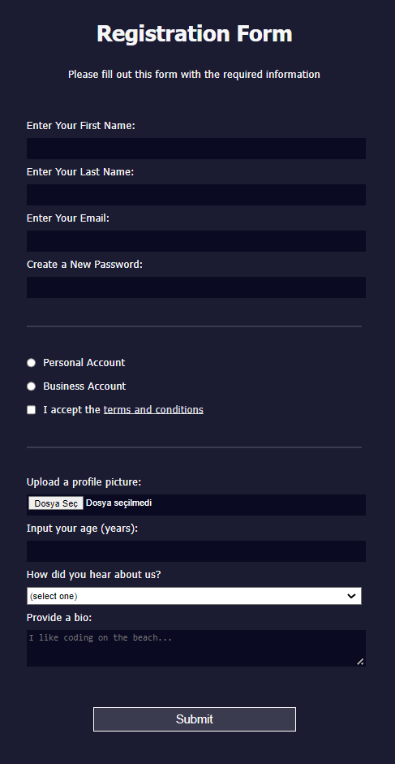

#Color Markers
---
+ This is a task for Responsive Web Design course of [freeCodeCamp](https://www.freecodecamp.org/learn/2022/responsive-web-design/).

+ Its goal is building a signup page with using HTML forms.

+ It contains how to control what types of data people can type into your form, and some new CSS tools for styling your page.

---

