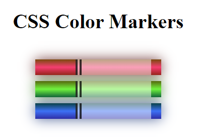

#Color Markers
---
+ This is a task for Responsive Web Design education of [freeCodeCamp](https://www.freecodecamp.org/learn/2022/responsive-web-design/).

+ Its goal is building a set of colored markers.

+ It contains different ways to set color values and how to pair colors with each other.

---

