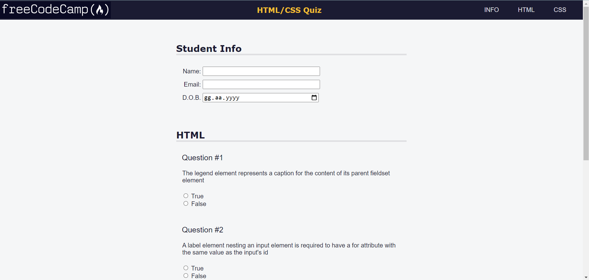

#Quiz Page
---
+ This is a task for Responsive Web Design course of [freeCodeCamp](https://www.freecodecamp.org/learn/2022/responsive-web-design/).

+ Its goal is building a quiz webpage with using HTML forms.

+ It contains accessibility tools such as keyboard shortcuts, ARIA attributes, and design best practices.

---

