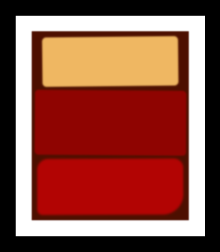

#Rothko Painting
---
+ This is a task for Responsive Web Design education of [freeCodeCamp](https://www.freecodecamp.org/learn/2022/responsive-web-design/).

+ Its goal is creating our own Rothko-style rectangular art pieces with using CSS and the Box Model.

---

