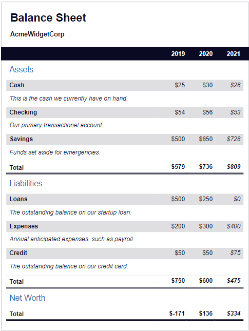

# Balance Sheet
<!-- You can use CSS pseudo selectors to change specific HTML elements.

In this course, you'll build a balance sheet using pseudo selectors. You'll learn how to change the style of an element when you hover over it with your mouse, and trigger other events on your webpage. -->

+ This is a task for Responsive Web Design course of [freeCodeCamp](https://www.freecodecamp.org/learn/2022/responsive-web-design/).

+ Its goal is building a Balance Sheet by using CSS pseudo selectors.

 

