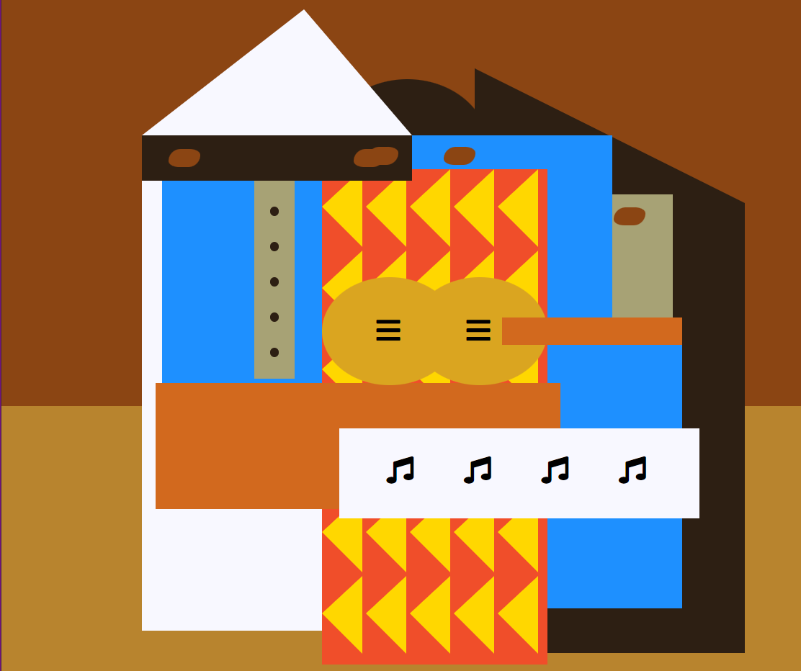

# Picasso Painting

+ This is a task for Responsive Web Design course of [freeCodeCamp](https://www.freecodecamp.org/learn/2022/responsive-web-design/).

+ Its goal is teaching how to use some intermediate CSS techniques by coding your own Picasso painting webpage.

+ It contains learning about SVG icons, CSS positioning, and review other CSS skills you've learned.

 

