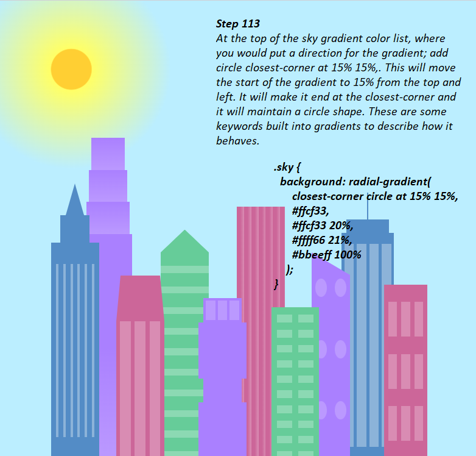
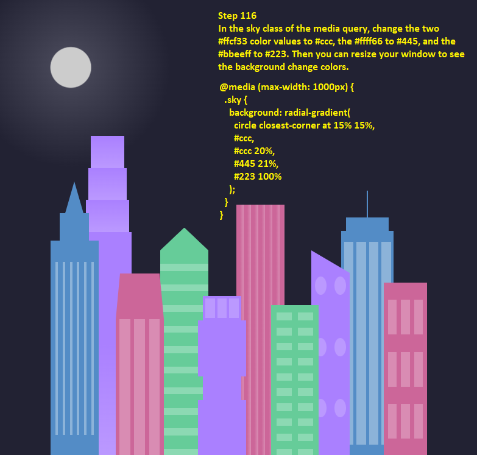
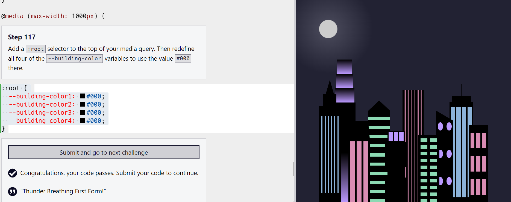

# City Skyline

+ This is a task for Responsive Web Design course of [freeCodeCamp](https://www.freecodecamp.org/learn/2022/responsive-web-design/).

+ Its goal is teaching how to organize our styles and reuse them by building our own City Skyline.

+ It contains learning how to configure CSS variables so you can reuse them whenever you want.

 

<video width="640" height="480" controls>
<source src="CitySkyline.mp4" type="video/mp4">
</video>

