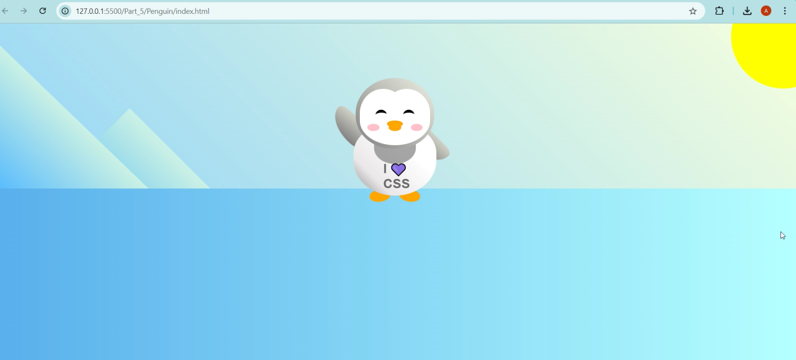

# Penguin

+ This is a task for Responsive Web Design course of [freeCodeCamp](https://www.freecodecamp.org/learn/2022/responsive-web-design/).

+ Its purpose is using CSS transforms to position and resize the parts of our penguin, create a background, and animate our work by building our own Penguin.

------

