Responsive_Web_Design_Projects
======

Projects built for Responsive Web Design Course of [freeCodeCamp](https://www.freecodecamp.org/learn/2022/responsive-web-design/).
 

and here is my [freeCodeCamp pofile](https://www.freecodecamp.org/anil_cetin) if u want to view my certicates about Front End Web Development

# Part  1
##  Learn HTML by Building a Cat Photo App
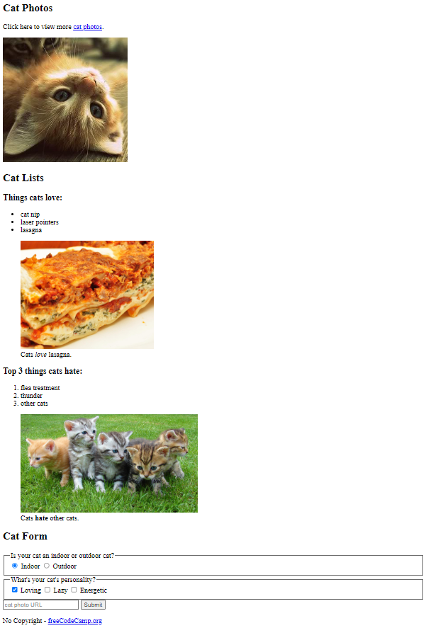

----

## Learn Basic CSS by Building a Cafe Menu
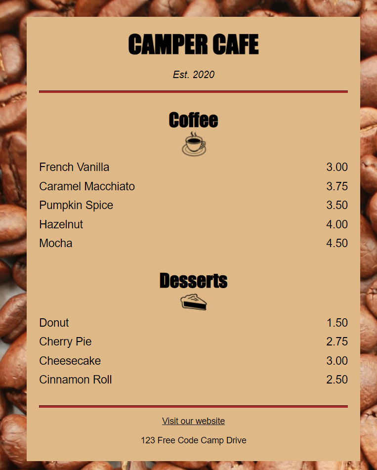

----
## Learn CSS Colors by Building a Set of Colored Markers

----
## Learn HTML by Building a Registration Form

----
## Certification Project 1: Survey Form
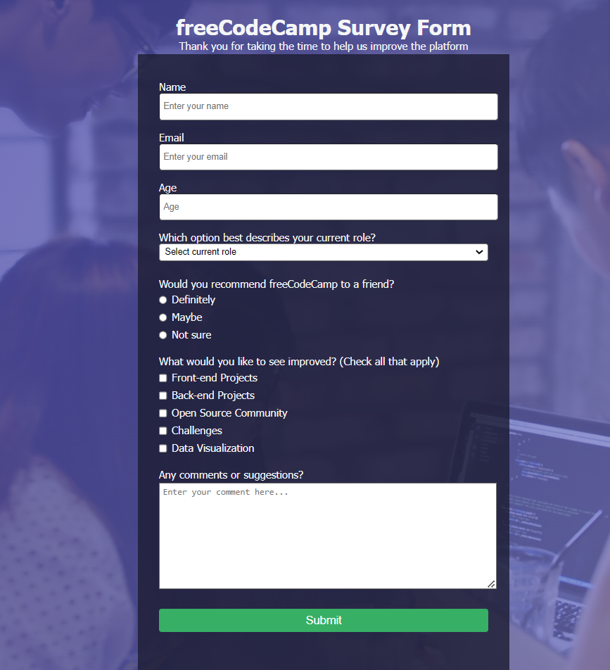

 
 
 

# Part 2
## Learn the CSS Box Model by Building a Rothko Painting

----
## Learn CSS Flexbox by Building a Photo Gallery

----
## Learn Typography by Building a Nutrition Label

----
## Learn Accessibility by Building a Quiz

----
## Certification Project 2: Tribute Page
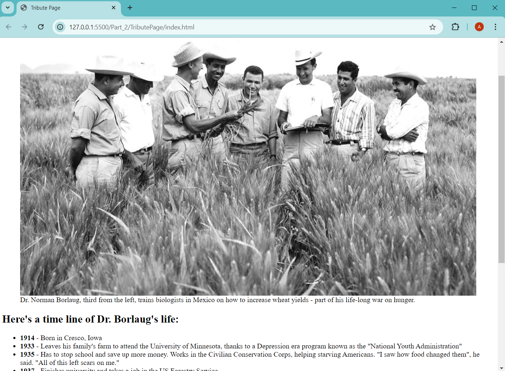

 
 
 

# Part 3
## Learn More About CSS Pseudo Selectors by Building a Balance Sheet

----
## Learn Intermediate CSS by Building a Picasso Painting (at Lagacy Version)

----
## Learn Intermediate CSS by Building a Cat Painting (at New Version)
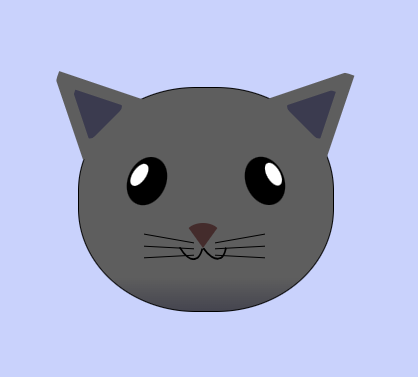

----
## Learn Responsive Web Design by Building a Piano
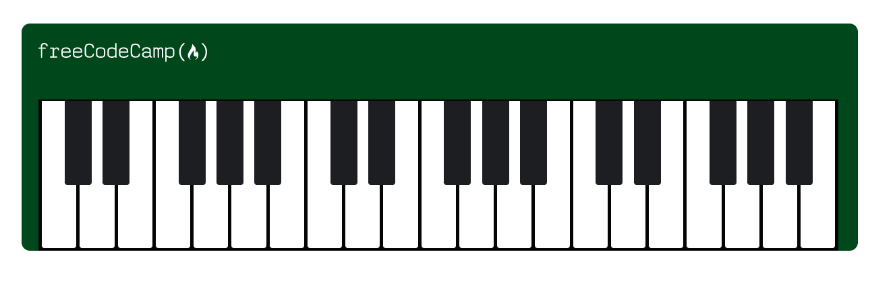

----
## Certification Project 3: Technical Documantation Page 
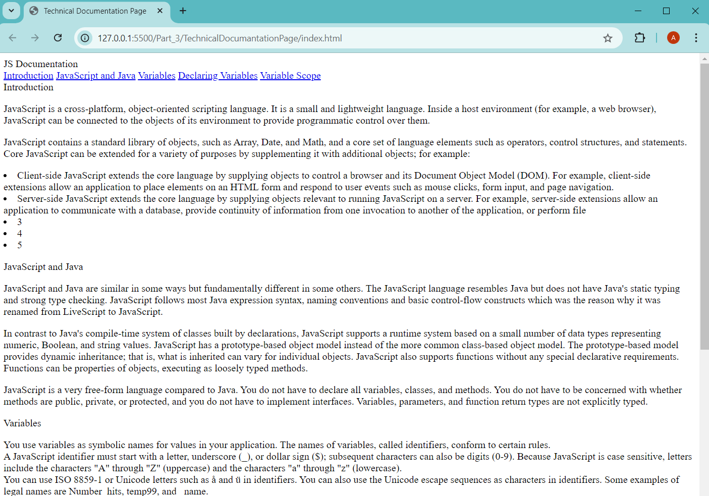

 
 
 

# Part 4
## Learn CSS Variables by Building a City Skyline
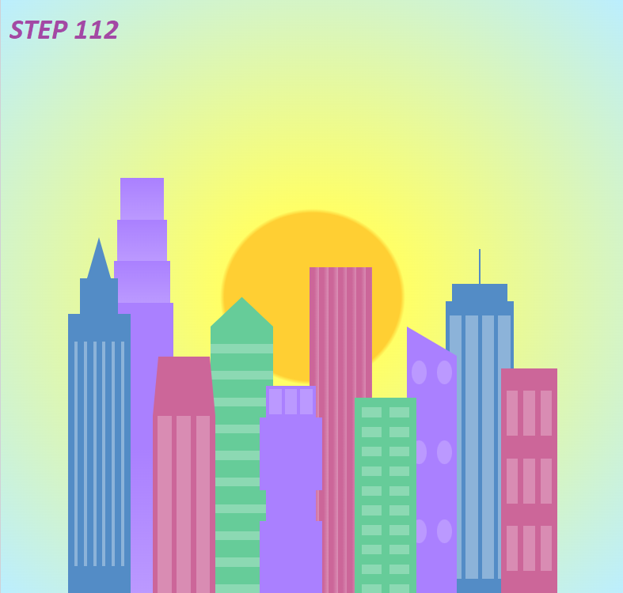

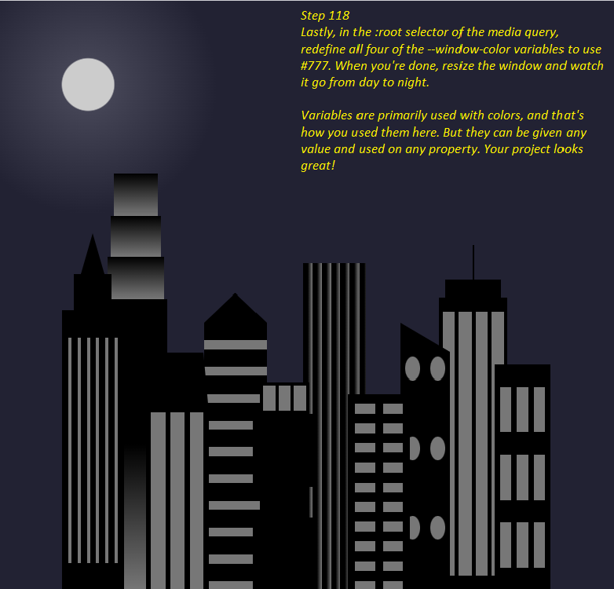

----
## Learn CSS Grid by Building a Magazine Page
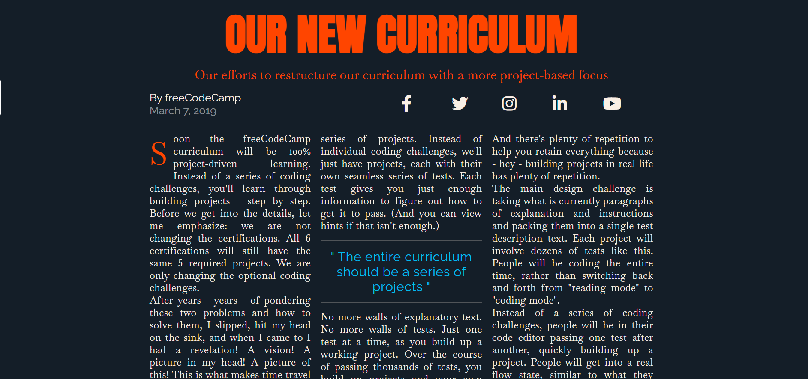

----

## Certification Project 4: Product Landing Page

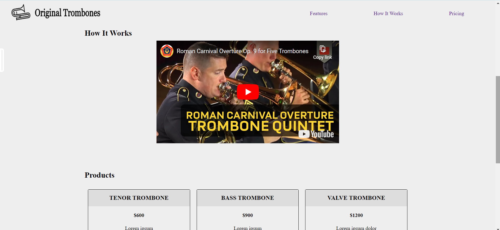
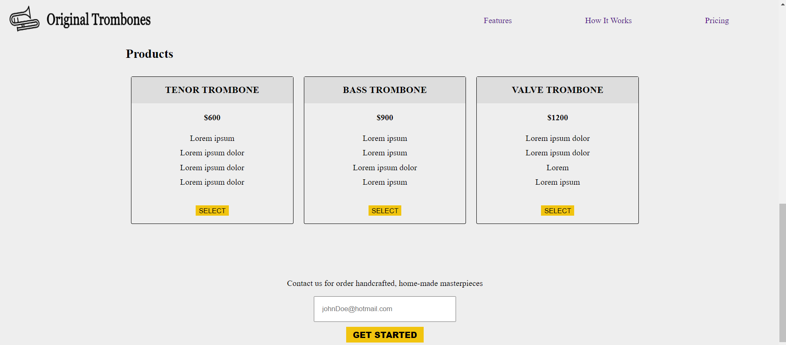

 
 
 

# Part 5 - Animations and Transforms
## Learn CSS Animation by Building a Ferris Wheel
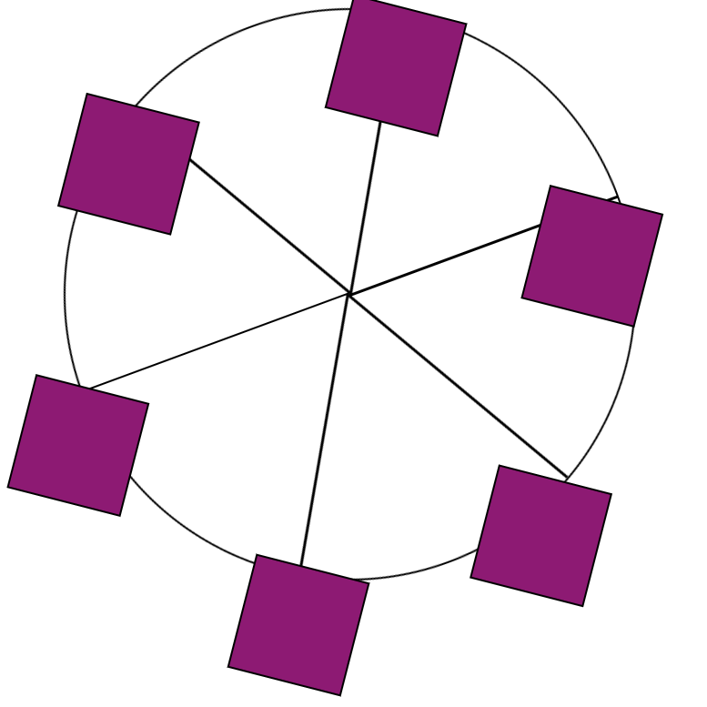

----
## Learn CSS Transforms by Building a Penguin

----
## Certification Project 5: Personal Portfolio Webpage
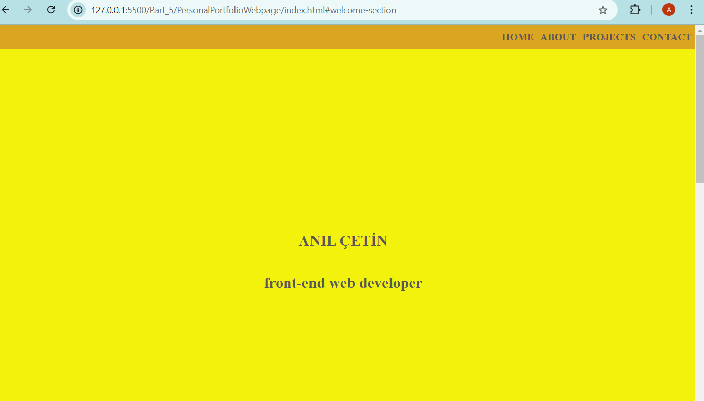

